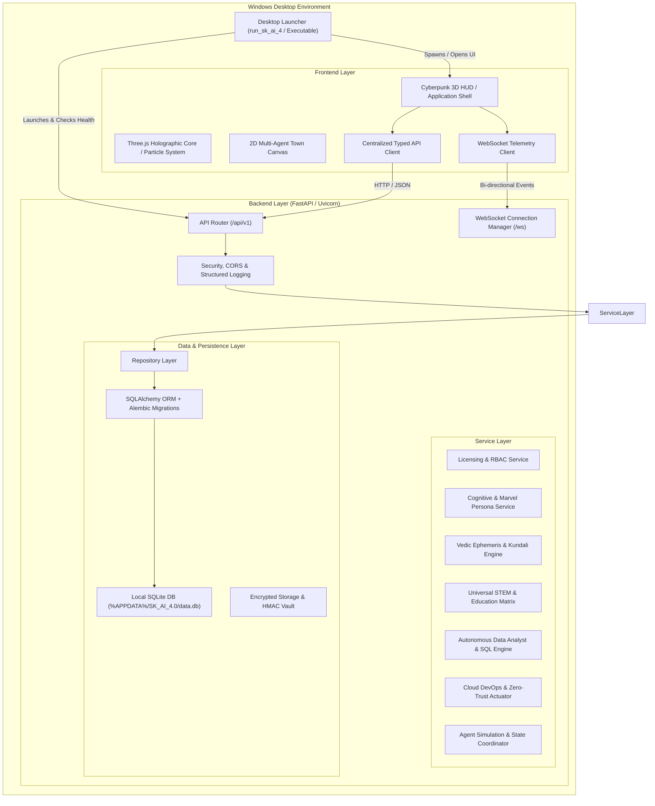
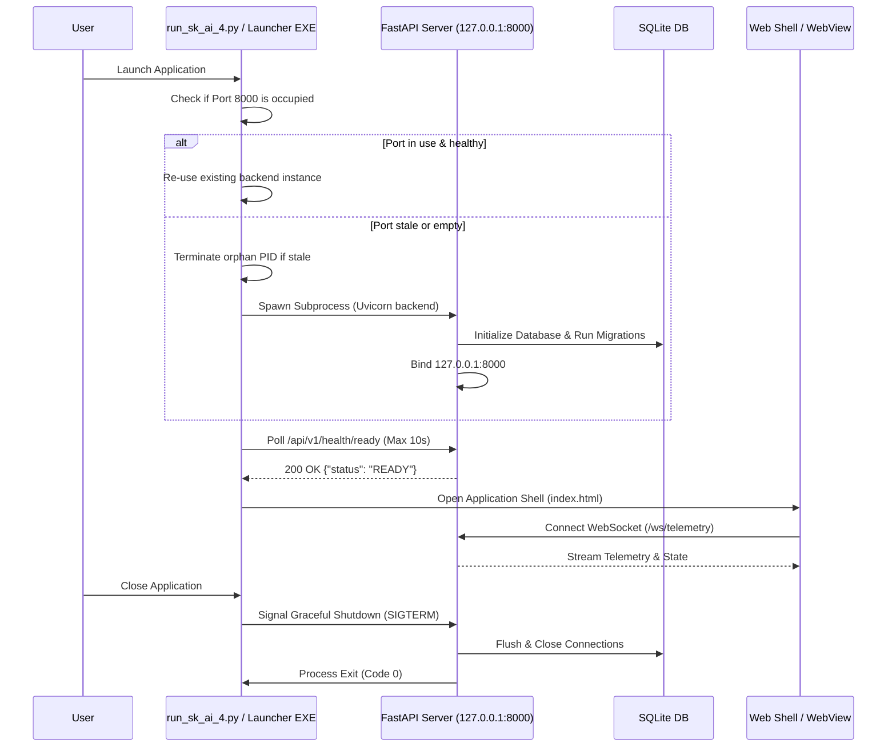

# SYSTEM ARCHITECTURE — SK AI 4.0 (PROJECT JARVIS 4.0)

**Document Version:** 1.0.0  
**Platform Version:** Jarvis Platform V5.0  
**Architect:** Sumeet Kumar (SK Enterprises) / Antigravity Principal Software Architect  
**Target Environment:** Windows 10/11 Desktop (x64) Local-First  

---

## 1. EXECUTIVE ARCHITECTURE OVERVIEW

SK AI 4.0 is a sovereign, local-first enterprise cognitive desktop application engineered for high-performance offline and hybrid AI workflows. The system integrates a robust Python FastAPI backend, a reactive WebGL/Three.js HUD frontend, SQLite persistence layer, real-time WebSocket telemetry, and Windows desktop lifecycle orchestration.

---

## 2. BACKEND ARCHITECTURE

The backend follows a modular **Clean Architecture / Layered Pattern** with strict separation of concerns.

### 2.1 Layer Hierarchy
1. **API Layer (`src_backend/app/api/v1/`)**: Versioned HTTP routes (`/api/v1/...`). Validates input with Pydantic schemas, delegates business logic to services, and returns strongly-typed response models.
2. **Service Layer (`src_backend/app/services/`)**: Implements domain business logic, orchestration across multiple engines, prompt sanitization, calculation algorithms, and business rule enforcement.
3. **Repository Layer (`src_backend/app/repositories/`)**: Abstracted database access operations. Isolates raw SQL/ORM operations from business logic.
4. **Data Models & Database (`src_backend/app/models/`, `src_backend/app/database/`)**: Declarative SQLAlchemy models, session lifecycle management, and migration configurations.
5. **Core & Configuration (`src_backend/app/core/`)**: System settings via `pydantic-settings`, structured loggers, environment detection, and path resolvers.
6. **Security & Cryptography (`src_backend/app/security/`)**: HMAC-SHA256 token verification, anti-tamper shields, license verification, and payload obfuscation.

### 2.2 Endpoint Taxonomy (`/api/v1/`)
- `/api/v1/health` - Liveness, readiness, and system telemetry checks
- `/api/v1/system/status` - Hardware metrics, identity lock, active nodes
- `/api/v1/chat` - Cognitive chat query processing, multi-persona routing
- `/api/v1/agent-town` - 2D Agent Town simulation state, room coordinates
- `/api/v1/astrology` - Vedic Kundali calculation, ephemeris prediction
- `/api/v1/education` - Assessment generation, STEM derivations, curricula
- `/api/v1/data` - DataFrame analysis, EDA cleaning pipeline, SQL synthesis
- `/api/v1/cloud` - Zero-Trust workspace actuator, policy enforcement
- `/api/v1/admin` - Licensing, client onboarding, kill-switch control
- `/ws/telemetry` - 60 FPS real-time engine telemetry, agent positions, memory load

---

## 3. PERSISTENCE & DATA STORAGE ARCHITECTURE

### 3.1 Platform-Safe Storage Paths
In compliance with Windows UAC (User Account Control) standards, all persistent databases, user configurations, and logs are stored inside user profile directories, never in `Program Files` or volatile temporary directories:

- **Database Path:** `%APPDATA%\SK Enterprises\SK AI 4.0\sk_ai_master.db`
- **Logs Directory:** `%APPDATA%\SK Enterprises\SK AI 4.0\logs\`
- **User Storage:** `%APPDATA%\SK Enterprises\SK AI 4.0\storage\`

### 3.2 Relational Schema Design (SQLite + SQLAlchemy)
- `users`: Registered system clients, subscription tiers, active flags, creation metadata.
- `licenses`: Cryptographic license tokens, machine hardware signatures, expiry dates.
- `conversations` & `messages`: Chat logs, thought processes, persona tags, session links.
- `memories`: Key-value cognitive associative facts, category tags, importance scores.
- `audit_logs`: Security events, license validations, admin actions, error incidents.

---

## 4. FRONTEND ARCHITECTURE

The user interface delivers a high-tech Cyberpunk / Holographic HUD experience with responsive layout capabilities.

### 4.1 UI Components
- **Header HUD**: System identity lock, real-time node indicators, Super Admin & Onboarding modal launchers, voice language toggle.
- **Left Column**: 3D Isometric Emblem, 1-Second Instant Vedic Kundali calculator.
- **Center Canvas**: Interactive 4-Node Cognitive Matrix (Memory, Skills, Soul, Settings) + Three.js Holographic Particle Core.
- **Multi-Hub Workspace**: 2D Agent Town Canvas, Visual Brain graph, Gesture sensor view.
- **Right Column**: Real-time Cognitive Chat Stream, thought-process accordions, bilingual speech synth/mic interface.
- **Modals & Overlays**: Super Admin Control Hub, Client Onboarding Wizard, System Settings & Diagnostics.

### 4.2 Frontend Communications
- Single centralized API client module (`src_frontend/js/api_client.js`) handling timeouts, retries, error toast notifications, and offline graceful degradation.
- WebSocket stream manager (`src_frontend/js/ws_manager.js`) with automatic reconnection, heartbeat ping/pong, and UI state sync.

---

## 5. PROCESS LIFECYCLE & WINDOWS DESKTOP LAUNCHER

---

## 6. SECURITY & DEVSECOPS BOUNDARIES

1. **Local IPC Isolation**: The backend binds exclusively to `127.0.0.1`. CORS is strictly limited to localhost origins.
2. **Credential Protection**: No secrets, passwords, or private license keys committed to version control. Configuration is loaded via `.env` and environment variables.
3. **Anti-Extraction Shield**: Input queries are inspected for prompt injection, memory dump requests, or reverse-engineering payloads before dispatching to core engines.
4. **License & RBAC Gate**: Super Admin operations require HMAC-SHA256 verified tokens and authorized master PIN verification.
5. **Crash Resilience**: Structured exception handling at application boundaries ensures fatal errors trigger native Windows dialogs and log tracebacks to disk without silent termination.

---

## 7. WINDOWS PACKAGING & RELEASE PIPELINE

1. **PyInstaller Binary Compilation**: Compiles the complete Python runtime, FastAPI dependencies, SQLite drivers, and backend engine into an optimized standalone distribution package under `dist/SK_AI_4.0/`.
2. **Inno Setup Installer Generation**: Bundles the compiled binaries, assets, documentation, and registry keys into a single professional installer: `SK_AI_4.0_Setup_x64_v5.0.0.exe`.
3. **Automated Verification**: Generates SHA256 checksums, uninstaller manifests, and test runs to guarantee zero external Python/Node dependencies on target machines.
