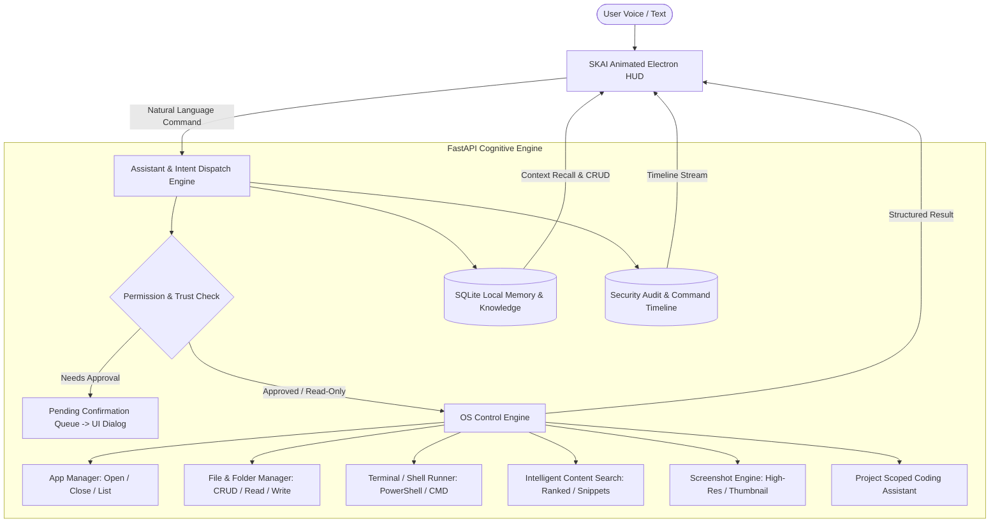

# Implementation Plan: SKAI Desktop Assistant

SKAI is a local-first desktop AI assistant powered by SK Enterprises and engineered by Sumeet Kumar. This plan details the end-to-end transformation of the existing codebase into a unified, secure, local-first OS control assistant with an animated UI, voice and text input, intelligent local search, inspectable memory, robust permission/safety boundaries, and complete rebranding.

---

## User Review Required

> [!IMPORTANT]
> **Rebranding Scope**: Every instance of previous product names (such as "SK AI 4.0", "Project JARVIS 4.0", "Jarvis Platform V5.0", "SK JARVIS") and previous author variations will be completely updated across the entire codebase to:
> - **Product Name**: **SKAI**
> - **Tagline**: **SKAI — Powered by SK Enterprises**
> - **Owner / Author**: **Sumeet Kumar**
> - **Company**: **SK Enterprises**
> - **App ID**: `com.skenterprises.skai`

> [!NOTE]
> **Safety Default Configuration**: All destructive actions (deleting files, running arbitrary shell commands, killing processes, overwriting files) will strictly require interactive user confirmation on the UI by default, with configurable trust-level toggles in the Permissions settings screen.

---

## Proposed Architectural Changes

---

## Proposed Changes

### 1. Identity & Rebranding (Full Codebase Sweep)
Update all files across package configs, window titles, installer scripts, backend models, docs, and UI strings:
- [MODIFY] [package.json](file:///d:/Project%20SK%20AI%204.0/package.json) — Update name to `skai`, productName to `SKAI`, author to Sumeet Kumar, description to "SKAI — Powered by SK Enterprises".
- [MODIFY] [electron/main.js](file:///d:/Project%20SK%20AI%204.0/electron/main.js) — Update window titles, logs, identifiers to SKAI.
- [MODIFY] [electron/preload.js](file:///d:/Project%20SK%20AI%204.0/electron/preload.js) — Update bridge metadata.
- [MODIFY] [src_backend/app/core/config.py](file:///d:/Project%20SK%20AI%204.0/src_backend/app/core/config.py) — Update `PROJECT_NAME="SKAI"`, `TAGLINE="SKAI — Powered by SK Enterprises"`, `INVENTOR="Sumeet Kumar"`, `ORGANIZATION="SK Enterprises"`.
- [MODIFY] [config/system_identity.json](file:///d:/Project%20SK%20AI%204.0/config/system_identity.json) — Update system prompt and identity keys.
- [MODIFY] [README.md](file:///d:/Project%20SK%20AI%204.0/README.md), [LICENSE](file:///d:/Project%20SK%20AI%204.0/LICENSE), [EULA.md](file:///d:/Project%20SK%20AI%204.0/EULA.md), [PRIVACY_POLICY.md](file:///d:/Project%20SK%20AI%204.0/PRIVACY_POLICY.md), [TERMS_OF_USE.md](file:///d:/Project%20SK%20AI%204.0/TERMS_OF_USE.md), [THIRD_PARTY_NOTICES.md](file:///d:/Project%20SK%20AI%204.0/THIRD_PARTY_NOTICES.md).

---

### 2. OS Control Engine
Create a production-grade, secure, multi-capability OS actuator:
- [NEW] [src_backend/app/services/os_control_service.py](file:///d:/Project%20SK%20AI%204.0/src_backend/app/services/os_control_service.py)
  - `open_app(app_name: str)`: Opens Windows applications (e.g. `notepad`, `calc`, `explorer`, `code`, `chrome`, `msedge`, custom apps).
  - `close_app(app_name_or_pid: str)`: Closes running processes by name or PID gracefully.
  - `list_running_apps()`: Returns active user processes.
  - `create_file(path, content)`, `create_folder(path)`: Safe path-scoped creation.
  - `read_file(path)`: Reads plain text, markdown, python, json, yaml, etc.
  - `write_file(path, content, append=False)`: Modifies or creates files.
  - `move_file(src, dst)`, `rename_file(src, new_name)`: File relocation and renaming.
  - `delete_file(path, force=False)`: Controlled file and folder deletion.
  - `run_terminal_command(command, cwd=None, timeout=30)`: Executes PowerShell/CMD commands, capturing output streams, exit codes, execution duration.
  - `search_local_files(query, base_dir=None, content_search=True, max_results=20)`: Intelligent content-aware ranked search with text snippet matches and line numbers.
  - `take_screenshot(filename=None)`: Captures desktop displays using PIL / Win32, saves to `APPDATA_DIR/screenshots`, and returns thumbnail base64 and absolute path.
  - `code_assist_read_project(project_path)`, `code_assist_edit_file(...)`, `code_assist_run_tests(...)`: Project-scoped coding assistance.

---

### 3. Safety, Permission & Audit System
Implement an explicit action category and safety gate layer:
- [NEW] [src_backend/app/services/permission_service.py](file:///d:/Project%20SK%20AI%204.0/src_backend/app/services/permission_service.py)
  - Manages trust levels: `READ_ONLY`, `REVERSIBLE_WRITE`, `DESTRUCTIVE_HIGH_IMPACT`.
  - Configurable settings: Allowed directories, confirmation requirement toggles, web add-on enablement.
  - Pending action queue: Suspends high-impact actions until user explicitly approves via the UI.
- [NEW] [src_backend/app/api/v1/endpoints/permissions.py](file:///d:/Project%20SK%20AI%204.0/src_backend/app/api/v1/endpoints/permissions.py)
  - `GET /api/v1/permissions`: Get current safety policies and allowed folders.
  - `POST /api/v1/permissions`: Update policies (e.g. toggle confirmation rules, add allowed paths).
  - `POST /api/v1/permissions/action/confirm`: Approve or reject a pending destructive action.
- [NEW] [src_backend/app/api/v1/endpoints/os_control.py](file:///d:/Project%20SK%20AI%204.0/src_backend/app/api/v1/endpoints/os_control.py)
  - Direct REST endpoints for apps, files, terminal, search, screenshots, and coding tools.
- [MODIFY] [src_backend/app/api/v1/endpoints/diagnostics.py](file:///d:/Project%20SK%20AI%204.0/src_backend/app/api/v1/endpoints/diagnostics.py) / [src_backend/app/api/v1/endpoints/admin.py](file:///d:/Project%20SK%20AI%204.0/src_backend/app/api/v1/endpoints/admin.py)
  - Expose persistent command audit logs and safety history.

---

### 4. Local Memory & Knowledge Management
Enhance the existing SQLite memory engine with full CRUD and semantic recall:
- [NEW] [src_backend/app/api/v1/endpoints/memory.py](file:///d:/Project%20SK%20AI%204.0/src_backend/app/api/v1/endpoints/memory.py)
  - `GET /api/v1/memory`: List all stored memories with tags and categories.
  - `POST /api/v1/memory`: Add or update a durable fact.
  - `GET /api/v1/memory/search?q=...`: Search associative memories.
  - `DELETE /api/v1/memory/{id}`: Delete a memory entry.
- [MODIFY] [src_backend/app/repositories/memory_repo.py](file:///d:/Project%20SK%20AI%204.0/src_backend/app/repositories/memory_repo.py)
  - Add delete, update, and search methods.

---

### 5. Assistant & Natural Language Intent Dispatch Engine
Unify speech and text commands into automated OS execution:
- [NEW] [src_backend/app/services/assistant_service.py](file:///d:/Project%20SK%20AI%204.0/src_backend/app/services/assistant_service.py)
  - Multi-intent parsing (English & Hindi support):
    - App management ("open notepad", "launch calculator", "close chrome")
    - File operations ("create a file called test.txt on desktop", "read file test.txt", "delete file notes.txt")
    - Terminal commands ("run command dir", "execute git status")
    - Search requests ("search my documents for invoice", "find all python files")
    - Visual captures ("take a screenshot", "capture screen")
    - Memory storage & recall ("remember that I prefer dark mode", "what do you remember about my preferences?")
    - Coding assistant ("analyze code in project", "run tests")
  - Structured response generation:
    - `{ "status": "COMPLETED" | "REQUIRES_CONFIRMATION" | "ERROR", "action": "...", "category": "...", "result": {...}, "thought_process": "...", "voice_text": "...", "audit_id": 123 }`
- [MODIFY] [src_backend/app/api/v1/endpoints/chat.py](file:///d:/Project%20SK%20AI%204.0/src_backend/app/api/v1/endpoints/chat.py)
  - Wire chat requests to the new `AssistantService`.
- [MODIFY] [src_backend/app/api/v1/router.py](file:///d:/Project%20SK%20AI%204.0/src_backend/app/api/v1/router.py)
  - Mount new `os_control`, `permissions`, and `memory` routers.

---

### 6. Animated Frontend HUD & UI Rebrand
Upgrade the Electron interface to reflect modern, responsive UX:
- [MODIFY] [frontend/index.html](file:///d:/Project%20SK%20AI%204.0/frontend/index.html)
  - Brand header: **SKAI — Powered by SK Enterprises** (Sumeet Kumar).
  - State Indicator: Visual **Listening**, **Thinking**, **Acting**, **Done** states with real-time audio waveform / neural pulse.
  - Command Bar: Voice mic toggle (speech-to-text) + instant text input.
  - Command Results Timeline: Scrollable feed of past commands, structured outcomes, screenshot previews, terminal outputs.
  - Interactive Action Confirmation Modal: Displays pending destructive action with parameters, diffs, and Approve/Reject buttons.
  - Memory Inspector & Editor Modal: Live table of all stored facts, search bar, add fact form, delete buttons.
  - Intelligent Search Panel: Search results with matched lines and instant file viewing.
  - Permissions & Safety Settings Screen: Directory picker/input, confirmation toggles, Web tools toggle.
  - Web Tools Add-On (Optional): Clearly labeled, separate tab, toggled off by default.
- [MODIFY] [frontend/api_client.js](file:///d:/Project%20SK%20AI%204.0/frontend/api_client.js) & [frontend/js/api_client.js](file:///d:/Project%20SK%20AI%204.0/frontend/js/api_client.js)
  - Add client methods for OS control, permissions, memory CRUD, and action confirmation.

---

### 7. Documentation & "Try SKAI in 2 minutes" Demo
- [MODIFY] [README.md](file:///d:/Project%20SK%20AI%204.0/README.md)
  - Overview of SKAI (Local-first desktop AI assistant).
  - Setup instructions (Node, Electron, Python).
  - Prominent **"Try SKAI in 2 minutes"** demo script with example commands:
    1. `open notepad` (Launches Windows Notepad)
    2. `take a screenshot` (Captures desktop and shows preview)
    3. `create a file called test.txt on the desktop` (Creates test file)
    4. `remember that I prefer dark mode` (Persists durable fact in local SQLite)
    5. `what do you remember about my preferences?` (Recalls context)
    6. `search my documents for python` (Content search)
    7. `run command echo "SKAI is running"` (Terminal execution)
  - Table of Offline / Local vs Optional Online features.

---

## Verification Plan

### Automated Test Suite
Run comprehensive pytest tests covering:
1. `tests/test_os_control.py`: App management, file/folder operations, terminal commands, screenshot capture, local search.
2. `tests/test_permissions.py`: Action category trust levels, confirmation gates, policy enforcement.
3. `tests/test_memory_crud.py`: Memory storage, associative recall, deletion, API endpoints.
4. `tests/test_assistant_pipeline.py`: Natural language intent parsing, command dispatch, multi-language responses.
5. `pytest`: Run full test suite across all 40+ unit and integration tests.

### Manual Verification of Demo Script
Execute each command in the "Try SKAI in 2 minutes" script:
1. Speak/type `open notepad` -> verify Notepad opens and structured response is returned.
2. Speak/type `take a screenshot` -> verify screenshot is saved and rendered in UI.
3. Speak/type `create a file called test.txt on the desktop` -> verify file exists on Desktop.
4. Speak/type `remember that I prefer dark mode` -> verify memory item is added and visible in Memory modal.
5. Speak/type `what do you remember about my preferences?` -> verify accurate recall.
6. Speak/type `run command dir` -> verify terminal output is returned and logged in Audit trail.
7. Attempt a destructive action (e.g. `delete file test.txt`) -> verify confirmation dialog triggers and waits for user approval.
8. Launch Electron app via `npm start` / `run_sk_ai_4.py` -> verify no startup crashes or console errors.
